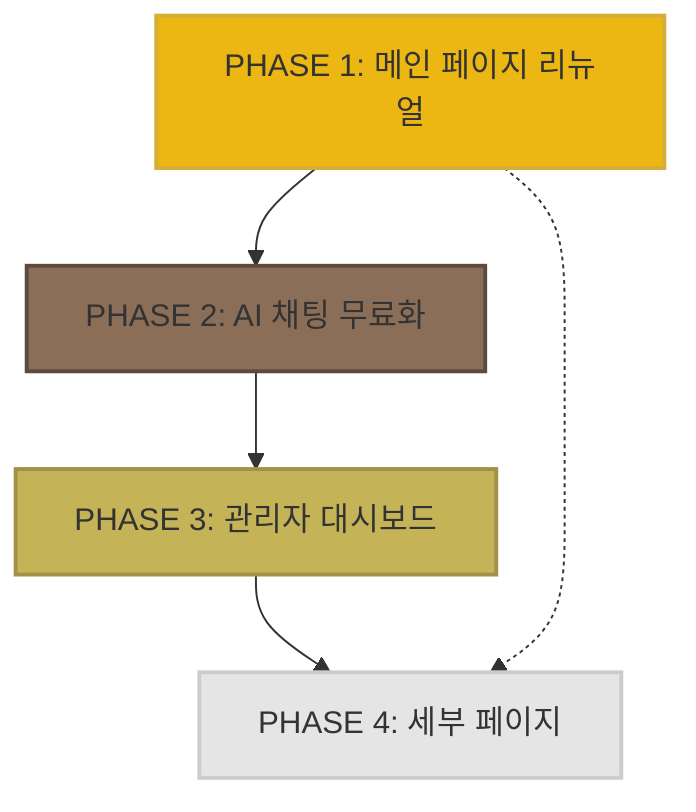

# 🗺️ 해화당 프로젝트 전체 로드맵

## 📋 프로젝트 개요
**목표**: 메인 페이지 리뉴얼 + AI 채팅 무료화 + 관리자 대시보드 고도화 + 세부 페이지 완성

**총 기간**: 약 6-8주 (각 Phase별 순차 진행)

---

## 🎯 PHASE 구성 및 순서

| Phase | 제목 | 주요 목표 | 예상 기간 | 완료 조건 |
|-------|------|-----------|-----------|----------|
| **1** | 메인 페이지 리뉴얼 | 마케팅 이벤트 추가, UX 개선 | 2주 | 이벤트 배너/출석/룰렛 작동, QA 통과 |
| **2** | AI 채팅 무료화 | 무료 사용자도 1일 1회 사용 가능 | 1주 | 무료/PRO 차등 제한, 업그레이드 유도 |
| **3** | 관리자 대시보드 고도화 | 실시간 모니터링, 마케팅 인사이트 | 2주 | Recent Activity 실시간, UTM 분석 |
| **4** | 세부 페이지 구현 | 주간/월간 운세, 초대 시스템 등 | 2주 | 5개 페이지 완성, 통합 테스트 |

---

## 📊 Phase별 상세 일정

### PHASE 1: 메인 페이지 리뉴얼 (2주)

#### Week 1 (DB & Backend)
- **Day 1-3**: DB 설계 및 마이그레이션
  - `daily_attendance` 테이블
  - `roulette_history` 테이블
  - `event_banners` 테이블
  - RPC 함수 작성
- **Day 4-5**: Server Actions 구현
  - `daily-check-actions.ts`
  - `roulette-actions.ts`
  - 부적 지급 로직 통합

#### Week 2 (Frontend & Testing)
- **Day 1-2**: 컴포넌트 구현
  - 이벤트 배너 (`event-banners.tsx`)
  - 일일 출석 UI (`daily-check-in.tsx`)
  - 행운의 룰렛 UI (`lucky-roulette.tsx`)
  - 온보딩 툴팁 시스템
- **Day 3**: QA 테스트
  - 크로스 브라우저 테스트
  - 모바일 반응형 확인
  - 출석/룰렛 엣지 케이스 테스트
- **Day 4**: 디버깅 & 문서화
  - 버그 수정
  - 성능 최적화 (Lighthouse 90+)
  - CHANGELOG 업데이트

**승인 기준**:
- ✅ 이벤트 배너 3종 표시
- ✅ 일일 출석 연속 보너스 작동
- ✅ 룰렛 1일 1회 제한 작동
- ✅ 온보딩 툴팁 신규 사용자에게 표시
- ✅ Lighthouse 점수 90점 이상

---

### PHASE 2: AI 채팅 무료화 (1주)

#### Day 1 (Backend)
- DB 마이그레이션
  - `ai_chat_usage` 테이블
  - RPC 함수 (`increment_ai_chat_usage`, `record_ai_chat_turn`)
- Server Actions 수정
  - `ai-shaman-chat.ts` 무료/PRO 로직 추가
  - `wallet-actions.ts` 차등 차감

#### Day 2-3 (Frontend)
- UI 수정
  - 사용 횟수 표시 추가
  - 무료/PRO 배지
  - 업그레이드 유도 배너
  - 프리미엄 비교 모달

#### Day 4 (Testing & Debug)
- QA 테스트
  - 무료 1일 1회 제한 확인
  - PRO 무제한 확인
  - 부적 차등 차감 (무료 100장, PRO 50장)
  - 보안 검증 (클라이언트 조작 방지)
- 버그 수정 및 문서화

**승인 기준**:
- ✅ 무료 사용자 1일 1회 사용 가능
- ✅ PRO 사용자 무제한 사용
- ✅ 업그레이드 배너 표시
- ✅ 보안 검증 통과

---

### PHASE 3: 관리자 대시보드 고도화 (2주)

#### Week 1 (Backend & Realtime)
- **Day 1-2**: DB 설계
  - `activity_logs` 테이블 (자동 트리거)
  - `utm_tracking` 테이블
  - `funnel_events` 테이블
  - `traffic_hourly` 집계 테이블
  - RPC 함수 4종
- **Day 3-4**: Server Actions
  - `admin-dashboard-actions.ts`
  - Supabase Realtime 구독 설정
  - 빠른 액션 (공지, 쿠폰 발급)

#### Week 2 (Frontend & Analytics)
- **Day 1-2**: 컴포넌트 구현
  - Recent Activity Live (`recent-activity-live.tsx`)
  - Traffic Chart (`traffic-chart.tsx`)
  - UTM Performance Table
  - Funnel Analysis Visualization
- **Day 3**: 통합 테스트
  - 실시간 업데이트 확인
  - 차트 데이터 정확성 검증
- **Day 4**: 디버깅 & 문서화

**승인 기준**:
- ✅ Recent Activity 실시간 스트리밍
- ✅ 시간대별 트래픽 차트 표시
- ✅ UTM 성과 분석 작동
- ✅ Funnel 이탈률 분석 표시
- ✅ 빠른 액션 3종 작동

---

### PHASE 4: 세부 페이지 구현 (2주)

#### Week 1 (운세 페이지)
- **Day 1-2**: 주간 운세
  - 7일 타임라인 UI
  - AI 생성 또는 미리 계산된 운세 데이터
- **Day 3-4**: 월간 운세
  - 캘린더 히트맵
  - Recharts 그래프
  - 최고/최저의 날 하이라이트

#### Week 2 (이벤트 & 초대)
- **Day 1**: 일일 출석 페이지
  - PHASE 1 액션 재사용
  - 보상 캘린더 UI
- **Day 2**: 행운의 룰렛 페이지
  - 회전 애니메이션
  - Confetti 효과
- **Day 3**: 친구 초대 페이지
  - 초대 링크 생성
  - 통계 표시
  - 공유 기능 (Web Share API)

#### Week 2 (통합 & 테스트)
- **Day 4**: QA 전체 수행
  - 5개 페이지 모두 작동 확인
  - 페이지 간 내비게이션 테스트
  - SEO 메타데이터 검증
  - 모바일 반응형 확인

**승인 기준**:
- ✅ 주간/월간 운세 페이지 작동
- ✅ 일일 출석 페이지 작동
- ✅ 룰렛 페이지 작동
- ✅ 친구 초대 페이지 작동
- ✅ 전체 통합 테스트 통과

---

## 👥 에이전트 역할 분담표

| 에이전트 | 주요 담당 | Phase 1 | Phase 2 | Phase 3 | Phase 4 |
|----------|-----------|---------|---------|---------|---------|
| **👑 CLAUDE** | 총괄 지휘, 최종 승인 | ✅ | ✅ | ✅ | ✅ |
| **🎨 FE_VISUAL** | UI 디자인, 애니메이션 | 이벤트 배너, 온보딩 | 업그레이드 모달 | 대시보드 UI | 운세 페이지 UI |
| **⚙️ FE_LOGIC** | React 로직, 상태 관리 | 출석/룰렛 로직 | 사용 횟수 추적 | 실시간 컴포넌트 | 페이지 로직 |
| **🛡️ BE_SYSTEM** | Server Actions, 비즈니스 로직 | 출석/룰렛 액션 | AI 채팅 무료화 | 관리자 액션 | 운세 액션 |
| **🗄️ DB_MASTER** | 스키마 설계, 마이그레이션 | 3개 테이블 설계 | 1개 테이블 설계 | 4개 테이블 설계 | - |
| **📢 VIRAL** | SEO, 마케팅 문구 | 이벤트 카피라이팅 | 전환율 최적화 | UTM 추적 | SEO 메타데이터 |
| **✍️ POET** | UX 라이팅, 감성 문구 | CTA 문구 개선 | 업그레이드 유도 | - | 운세 문구 |
| **🕵️ SHERLOCK** | QA, 버그 추적 | 출석/룰렛 테스트 | 무료화 테스트 | 실시간 테스트 | 전체 통합 테스트 |
| **⚖️ AUDITOR** | 코드 리뷰, 보안 검증 | 코드 리뷰 | 보안 검증 | 관리자 권한 검증 | 최종 리뷰 |
| **📚 LIBRARIAN** | 문서화, CHANGELOG | 문서 작성 | API 문서 업데이트 | 대시보드 가이드 | 최종 문서화 |

---

## 📦 주요 산출물 (Deliverables)

### PHASE 1
- [ ] `components/events/event-banners.tsx`
- [ ] `components/events/daily-check-in.tsx`
- [ ] `components/events/lucky-roulette.tsx`
- [ ] `app/actions/daily-check-actions.ts`
- [ ] `app/actions/roulette-actions.ts`
- [ ] `supabase/migrations/20260211_phase1_events.sql`
- [ ] `.agent/phases/PHASE_1_QA_SCENARIOS.md`
- [ ] `docs/PHASE_1_DEVELOPMENT.md`

### PHASE 2
- [ ] `app/actions/ai-shaman-chat.ts` (수정)
- [ ] `components/ai/shaman-chat-interface.tsx` (수정)
- [ ] `components/ai/premium-comparison-modal.tsx`
- [ ] `supabase/migrations/20260212_phase2_ai_chat_free.sql`
- [ ] `.agent/phases/PHASE_2_QA_SCENARIOS.md`

### PHASE 3
- [ ] `app/actions/admin-dashboard-actions.ts`
- [ ] `components/admin/recent-activity-live.tsx`
- [ ] `components/admin/traffic-chart.tsx`
- [ ] `supabase/migrations/20260213_phase3_admin_dashboard.sql`
- [ ] `middleware.ts` (UTM 추적)
- [ ] `app/admin/page.tsx` (대시보드 개선)

### PHASE 4
- [ ] `app/protected/fortune/weekly/page.tsx`
- [ ] `app/protected/fortune/monthly/page.tsx`
- [ ] `app/protected/events/daily-check/page.tsx`
- [ ] `app/protected/events/roulette/page.tsx`
- [ ] `app/protected/referral/page.tsx`
- [ ] `app/actions/fortune-actions.ts` (주간/월간 추가)
- [ ] `app/actions/referral-actions.ts`

---

## 🔄 Phase 간 의존성 관리

**주요 의존성**:
- PHASE 2는 PHASE 1의 부적 시스템 활용
- PHASE 3은 PHASE 1-2의 활동 로그 수집
- PHASE 4는 PHASE 1의 액션 재사용 (출석, 룰렛)

---

## ⚠️ 리스크 관리

| 리스크 | 영향도 | 완화 방안 |
|--------|--------|-----------|
| DB 마이그레이션 실패 | 🔴 높음 | 스테이징 환경에서 선 테스트, 롤백 스크립트 준비 |
| Realtime 성능 이슈 | 🟡 중간 | 폴링 방식 대체안 준비, 캐싱 전략 |
| AI 응답 지연 | 🟡 중간 | 응답 시간 제한 (30초), 로딩 상태 UX 개선 |
| 크로스 브라우저 호환성 | 🟡 중간 | 초기 테스트 강화, Polyfill 적용 |
| 부적 중복 지급 버그 | 🔴 높음 | 트랜잭션 처리, 중복 체크 로직 강화 |

---

## 📈 성공 지표 (KPI)

### Phase 1 완료 후
- [ ] 일일 출석률 50% 이상
- [ ] 이벤트 배너 클릭률 10% 이상
- [ ] 메인 페이지 체류 시간 30% 증가

### Phase 2 완료 후
- [ ] 무료 사용자 중 10% 이상 PRO 전환
- [ ] AI 채팅 일일 사용자 50% 증가

### Phase 3 완료 후
- [ ] UTM 추적 데이터 수집 시작
- [ ] 관리자 대시보드 일일 접속 1회 이상

### Phase 4 완료 후
- [ ] 친구 초대 전환율 5% 이상
- [ ] 전체 페이지 이탈률 20% 감소

---

## 🎉 프로젝트 완료 체크리스트

### 기능 완료
- [ ] PHASE 1 모든 기능 작동
- [ ] PHASE 2 모든 기능 작동
- [ ] PHASE 3 모든 기능 작동
- [ ] PHASE 4 모든 기능 작동
- [ ] 전체 통합 테스트 통과

### 품질 보증
- [ ] Lighthouse 점수 90점 이상 (모든 주요 페이지)
- [ ] 크로스 브라우저 테스트 통과
- [ ] 모바일 반응형 확인
- [ ] 접근성 (a11y) 기본 준수
- [ ] 보안 검증 완료

### 문서화
- [ ] 모든 Phase별 개발 문서 작성
- [ ] API 문서 최신화
- [ ] CHANGELOG 업데이트
- [ ] README 업데이트

### 배포 준비
- [ ] 환경 변수 설정 확인
- [ ] DB 백업
- [ ] 모니터링 설정 (Sentry 등)
- [ ] 스테이징 배포 테스트
- [ ] 프로덕션 배포

---

## 📞 긴급 연락 체계

**Phase 진행 중 문제 발생 시**:
1. **SHERLOCK** - 버그 확인 및 재현
2. **AUDITOR** - 코드 리뷰 및 원인 분석
3. **해당 에이전트** - 수정 작업
4. **CLAUDE** - 최종 승인 및 다음 단계 결정

**승인 프로세스**:
1. 에이전트 작업 완료 → 자체 테스트
2. SHERLOCK QA 테스트
3. AUDITOR 코드 리뷰
4. CLAUDE 최종 승인 → 다음 Phase 진행

---

**시작 준비 완료!** 🚀

대표님, PHASE 1부터 시작하시겠습니까?
아니면 특정 Phase를 우선적으로 진행하시겠습니까?
