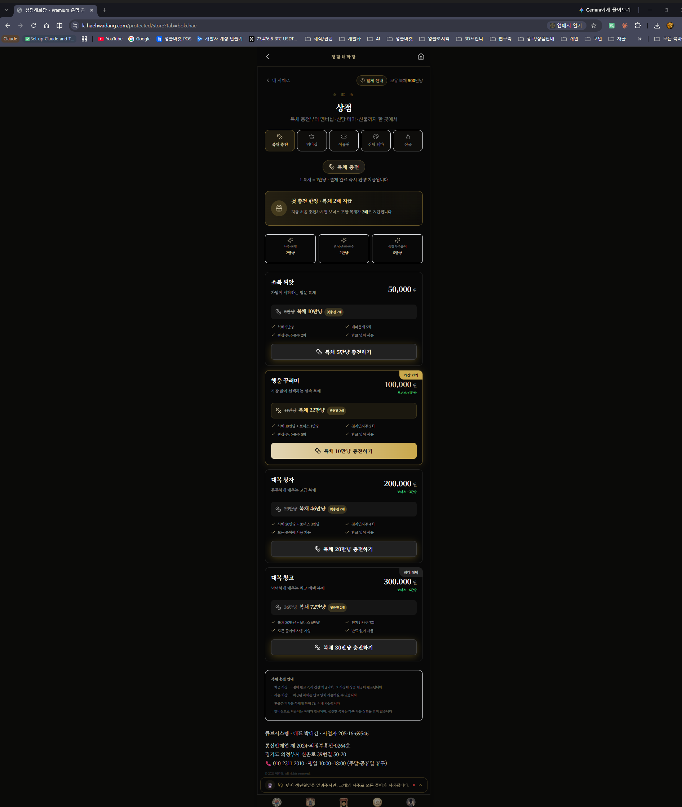

# 홈페이지 결제경로 — 일반결제

**청담해화당 · https://k-haehwadang.com**

토스페이먼츠 「홈페이지 결제경로 제작 가이드 — 일반결제용(17p)」 기준
상점아이디(MID) **`khaehwjxqe`**

---

## ① 가맹점 정보

| 항목                   | 내용                                                |
| ---------------------- | --------------------------------------------------- |
| **상호명**             | 큐브시스템                                          |
| **대표자명**           | 박대건                                              |
| **사업자등록번호**     | 205-16-69546                                        |
| **통신판매업신고번호** | 제2024-의정부흥선-0264호                            |
| **사업장 주소**        | 경기도 의정부시 신촌로 39번길 50-20                 |
| **연락처**             | 010-2311-2010 (평일 10:00–18:00, 주말·공휴일 휴무)  |
| **홈페이지 URL**       | https://k-haehwadang.com                            |
| **판매 상품**          | 이용권("복채") 충전 4종 (무형 디지털 콘텐츠 이용권) |

### 심사용 테스트 계정

| 항목         | 내용                |
| ------------ | ------------------- |
| **아이디**   | qa@k-haehwadang.com |
| **비밀번호** | q1w2e3r4            |

로그인 후 하단 **프로필 → 상점 → 복채 충전** 탭에서 아래 ⑤·⑥ 화면을 모두 확인하실 수 있습니다.

---

## 서비스 개요

청담해화당은 전통 명리학을 기반으로 **사주·궁합·관상·손금·풍수 분석 결과를 제공하는 AI 무형 콘텐츠 서비스**입니다.

일반결제 상품인 **복채**는 분석 서비스를 이용하기 위한 **선불 이용권**입니다. 충전한 이용권은 유효기간 없이 사용할 수 있으며, 분석 1건마다 정해진 수량이 차감됩니다.

| 분석 종류          | 1회 차감 |
| ------------------ | -------- |
| 사주 · 궁합        | 2만냥    |
| 관상 · 손금 · 풍수 | 2만냥    |
| 종합사주풀이       | 5만냥    |

멤버십에 가입하지 않아도 이용권 충전만으로 모든 분석을 이용할 수 있습니다.

---

## ② 하단정보

**위치** — 홈페이지 전 페이지 하단 (상시 노출)

**설명**

모든 페이지 하단에 사업자 정보 6개 항목이 상시 표시됩니다.

- 상호명 — 큐브시스템
- 대표자명 — 박대건
- 사업자등록번호 — 205-16-69546
- 통신판매업신고번호 — 제2024-의정부흥선-0264호
- 사업장 주소 — 경기도 의정부시 신촌로 39번길 50-20
- 연락처 — 010-2311-2010 (평일 10:00–18:00)

이용약관·개인정보처리방침·고객센터 링크도 함께 노출됩니다.

---

## ③ 환불규정

**위치** — `https://k-haehwadang.com/terms` → **제7조 (청약철회 및 환불)** · 로그인 없이 열람 가능

**설명**

이용약관 제7조에 무형 디지털 콘텐츠의 청약철회 및 환불 기준을 명시하고 있습니다.

1. 유료 서비스 구매일로부터 **7일 이내 청약철회** 가능. 단, 이미 이용권을 사용해 분석 서비스를 이용한 경우와 디지털 콘텐츠 제공이 개시된 경우는 「전자상거래 등에서의 소비자보호에 관한 법률」 제17조 제2항에 따라 제한됩니다.
2. **미사용 이용권은 결제일로부터 7일 이내 전액 환불**, 7일 경과 후에는 미사용 금액의 **90% 환불**(수수료 10%).
3. 멤버십 환불은 이용 일수에 따라 일할 계산하여 잔여 금액을 환불합니다.
4. 환불은 **원래 결제수단으로** 처리되며, 결제수단에 따라 최대 영업일 기준 7일이 소요될 수 있습니다.

---

## ④ 로그인 / 회원가입 경로

### ④-1 로그인

**위치** — `https://k-haehwadang.com/auth/login`

**설명**

이메일·비밀번호 로그인과 소셜 로그인(Google, 카카오)을 제공합니다. **결제는 로그인한 회원만 가능**하며 비회원 결제는 제공하지 않습니다.

### ④-2 회원가입

**위치** — `https://k-haehwadang.com/auth/sign-up`

**설명**

이름·성별·생년월일·이메일·비밀번호를 입력받는 회원가입 화면입니다. 가입 시 **이용약관 동의(필수)** 와 **개인정보처리방침 동의(필수)** 를 각각 받으며, 두 문서는 링크로 바로 열람할 수 있습니다.

---

## ⑤ 상품선택 / 구매과정

**위치** — 로그인 후 `https://k-haehwadang.com/protected/store?tab=bokchae`

**설명**

일반결제로 판매하는 **이용권 충전 상품 4종**입니다. 각 상품에 **상품명과 판매가**, 지급되는 이용권 수량이 함께 표시됩니다.

| 상품명      | 판매가    | 지급 이용권 |
| ----------- | --------- | ----------- |
| 소복 씨앗   | 50,000원  | 5만냥       |
| 행운 꾸러미 | 100,000원 | 10만냥      |
| 대복 상자   | 200,000원 | 20만냥      |
| 대복 창고   | 300,000원 | 30만냥      |

화면 하단에 **이용 안내**가 함께 표시됩니다 — 충전된 이용권은 만료 기간 없이 영구 사용 가능, 결제 완료 즉시 지급, 환불은 미사용 이용권에 한해 7일 이내 가능.

---

## ⑥ 카드 결제경로

**경로** — 상점 → 복채 충전 탭 → 상품 선택 → 결제하기 → 토스페이먼츠 결제창 → 결제수단 선택 → **카드사 선택 → 카드사 인증**

### ⑥-1 상품 선택 및 결제 요청

**설명**

구매할 상품을 선택한 화면입니다. 결제 직전에 **상품명과 결제 금액**이 다시 표시됩니다.

### ⑥-2 토스페이먼츠 결제창 — 결제수단 선택

**설명**

토스페이먼츠 결제창이 열린 화면입니다. **가맹점명, 주문명, 결제 금액**이 표시되며 결제수단을 선택합니다.

### ⑥-3 카드사 선택

**설명**

신용·체크카드를 선택한 뒤 결제할 카드사를 고르는 화면입니다.

### ⑥-4 비씨(BC)카드 인증 — 페이북 결제창

**설명**

비씨카드를 선택했을 때 표시되는 **실제 카드 인증 화면(페이북)** 입니다.

> 일반결제 가이드 16p가 **비씨카드의 실제 결제 화면까지** 캡처하도록 명시하고 있어 별도로 첨부합니다.

---

## ⑦ 결제 취소 · 환불 신청 (권장 첨부)

**위치** — 로그인 후 `https://k-haehwadang.com/protected/payment/cancel`

**설명**

회원이 충전 결제를 직접 취소·환불 신청하는 화면입니다.

- 결제 내역에서 취소할 건을 선택
- 7일 이내 전액 환불, 이후 미사용 금액의 90% 환불
- 이미 이용권을 사용한 경우 사용분에 대한 안내 표시

고객센터를 거치지 않고 **회원이 스스로** 환불을 신청할 수 있습니다.

---

## 담당자 확인표

| #   | 요구 항목              | 파일명                 | 확인 |
| --- | ---------------------- | ---------------------- | ---- |
| ①   | 가맹점 정보 (표지)     | —                      | ☐    |
| ②   | 하단정보               | `02-하단정보.png`      | ☐    |
| ③   | 환불규정               | `03-환불규정.png`      | ☐    |
| ④-1 | 로그인                 | `04-로그인.png`        | ☐    |
| ④-2 | 회원가입               | `05-회원가입.png`      | ☐    |
| ⑤   | 상품선택               | `06-상품선택-복채.png` | ☐    |
| ⑥-1 | 결제 요청              | `07-결제요청.png`      | ☐    |
| ⑥-2 | 결제창 (결제수단 선택) | `08-결제창.png`        | ☐    |
| ⑥-3 | 카드사 선택            | `09-카드사선택.png`    | ☐    |
| ⑥-4 | 비씨카드 인증 (페이북) | `10-BC카드-페이북.png` | ☐    |
| ⑦   | 결제 취소·환불 (권장)  | `11-충전취소.png`      | ☐    |

**총 10장**

---

## 결제 대행

전 결제는 **토스페이먼츠**를 통해 처리되며, 당사는 카드번호 등 결제 정보를 직접 저장하지 않습니다.
