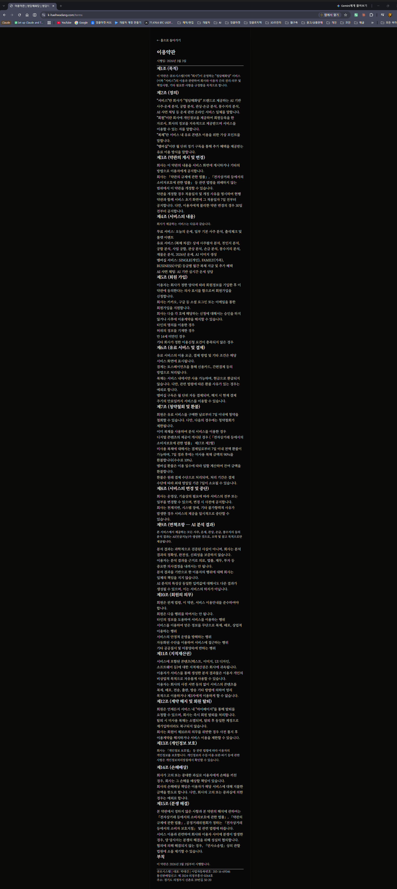
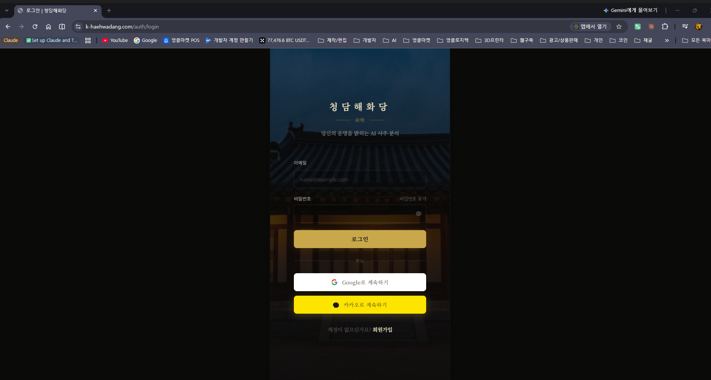
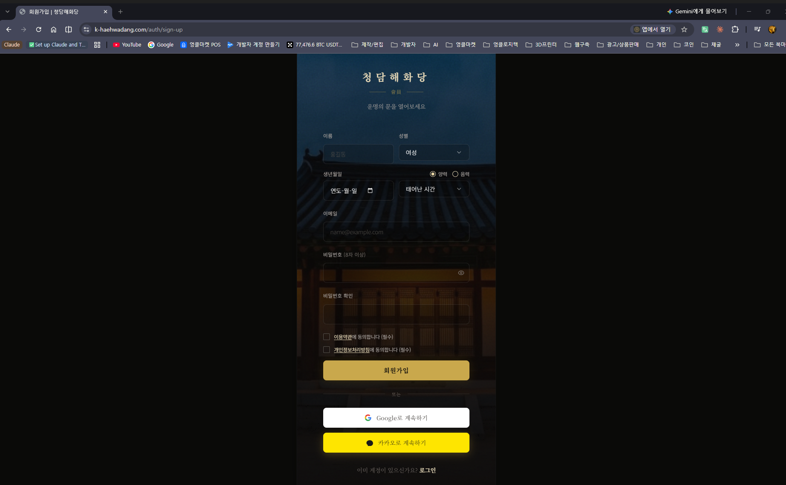
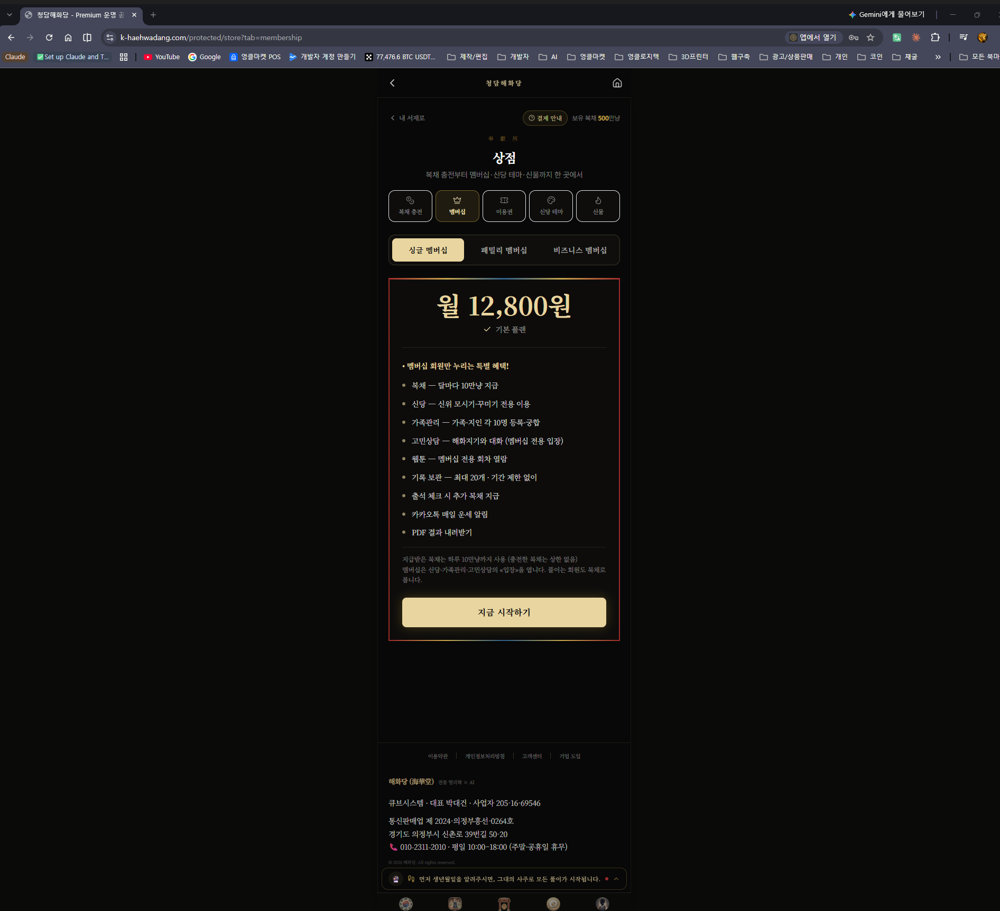
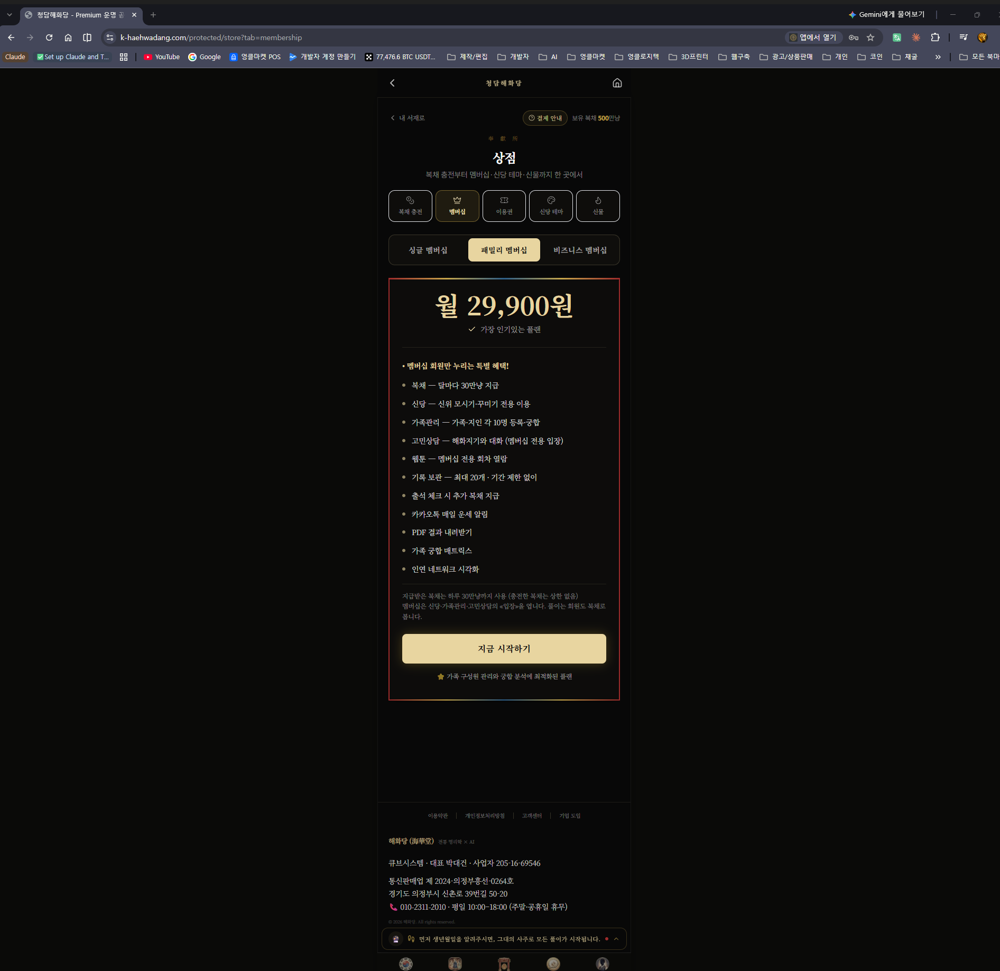
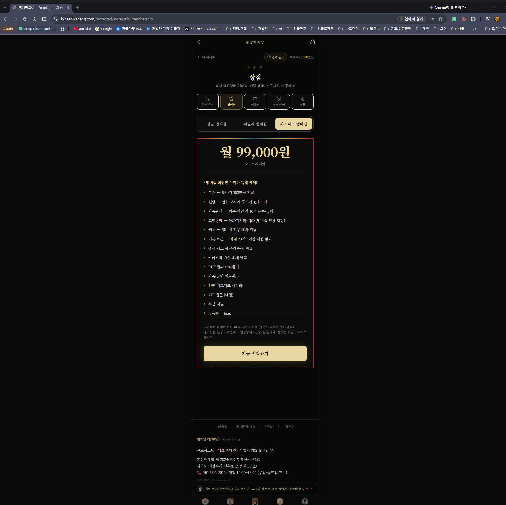
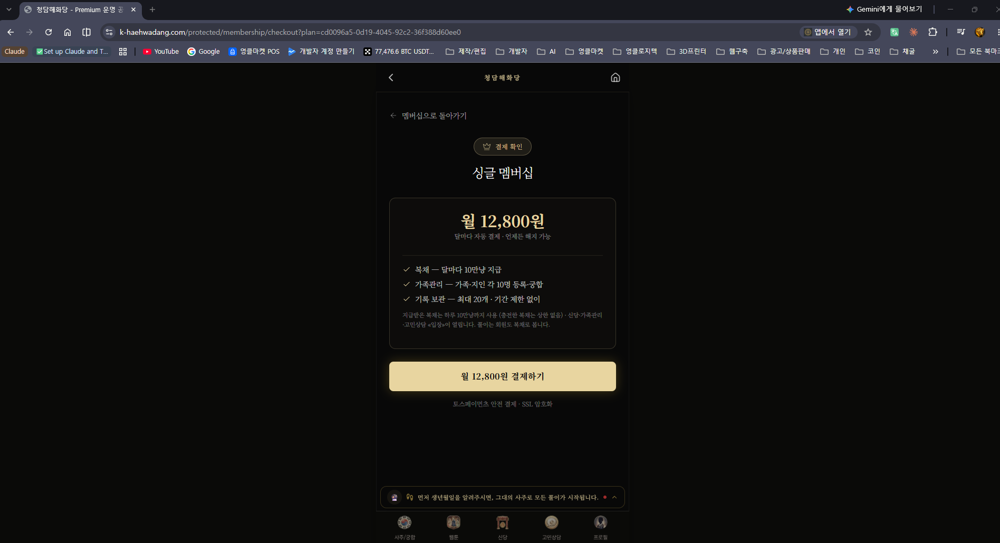
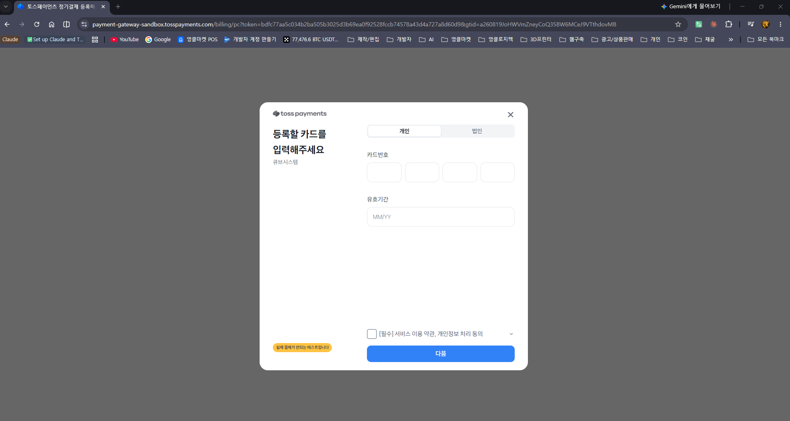
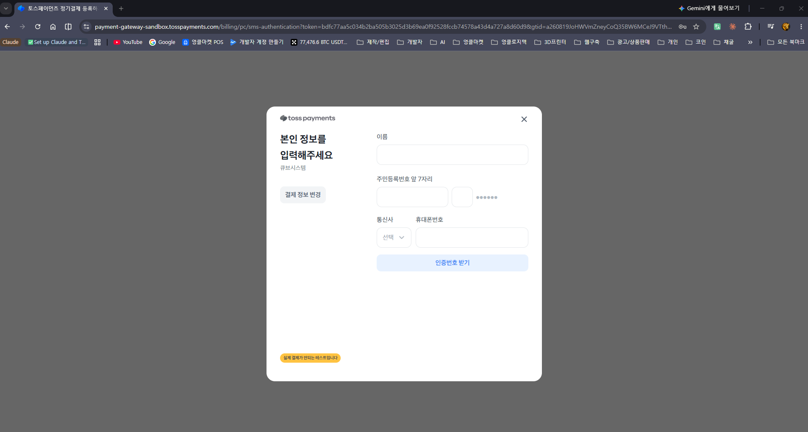
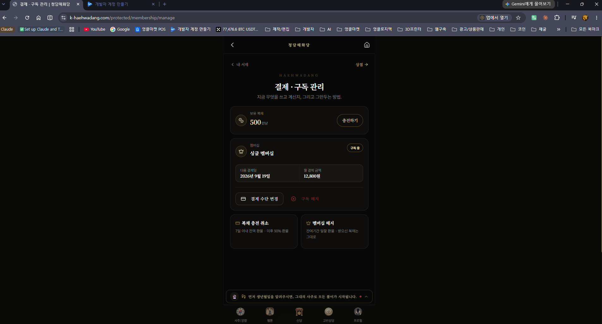

# 홈페이지 결제경로 — 정기결제

**청담해화당 · https://k-haehwadang.com**

토스페이먼츠 「홈페이지 결제경로 제작 가이드 — 정기결제용(14p)」 기준
상점아이디(MID) **`bill_khaehqj1a`**

---

## ① 가맹점 정보

| 항목                   | 내용                                               |
| ---------------------- | -------------------------------------------------- |
| **상호명**             | 큐브시스템                                         |
| **대표자명**           | 박대건                                             |
| **사업자등록번호**     | 205-16-69546                                       |
| **통신판매업신고번호** | 제2024-의정부흥선-0264호                           |
| **사업장 주소**        | 경기도 의정부시 신촌로 39번길 50-20                |
| **연락처**             | 010-2311-2010 (평일 10:00–18:00, 주말·공휴일 휴무) |
| **홈페이지 URL**       | https://k-haehwadang.com                           |
| **판매 상품**          | 월 자동결제 멤버십 3종 (무형 디지털 콘텐츠 이용권) |

### 심사용 테스트 계정

| 항목         | 내용                |
| ------------ | ------------------- |
| **아이디**   | qa@k-haehwadang.com |
| **비밀번호** | q1w2e3r4            |

로그인 후 하단 **프로필 → 상점 → 멤버십** 탭에서 아래 ⑤·⑥ 화면을 모두 확인하실 수 있습니다.

---

## 서비스 개요

청담해화당은 전통 명리학을 기반으로 **사주·궁합·관상·손금·풍수 분석 결과를 제공하는 AI 무형 콘텐츠 서비스**입니다.

정기결제 상품인 **멤버십**은 월 단위 자동결제로, 결제 주기마다 서비스 내 이용권("복채")이 지급되고 신당·가족관리·고민상담 기능의 이용 권한이 열립니다. 회원은 언제든 화면에서 직접 해지할 수 있으며, 해지 시 잔여 기간은 일할 계산하여 환불합니다.

---

## ② 하단정보

**위치** — 홈페이지 전 페이지 하단 (상시 노출)

**설명**

모든 페이지 하단에 사업자 정보 6개 항목이 상시 표시됩니다.

- 상호명 — 큐브시스템
- 대표자명 — 박대건
- 사업자등록번호 — 205-16-69546
- 통신판매업신고번호 — 제2024-의정부흥선-0264호
- 사업장 주소 — 경기도 의정부시 신촌로 39번길 50-20
- 연락처 — 010-2311-2010 (평일 10:00–18:00)

이용약관·개인정보처리방침·고객센터 링크도 함께 노출됩니다.

---

## ③ 환불규정

**위치** — `https://k-haehwadang.com/terms` → **제7조 (청약철회 및 환불)** · 로그인 없이 열람 가능

**설명**

이용약관 제7조에 무형 디지털 콘텐츠의 청약철회 및 환불 기준을 명시하고 있습니다.

1. 유료 서비스 구매일로부터 **7일 이내 청약철회** 가능. 단, 이미 이용권을 사용해 분석 서비스를 이용한 경우와 디지털 콘텐츠 제공이 개시된 경우는 「전자상거래 등에서의 소비자보호에 관한 법률」 제17조 제2항에 따라 제한됩니다.
2. 미사용 이용권은 결제일로부터 **7일 이내 전액 환불**, 7일 경과 후에는 미사용 금액의 **90% 환불**(수수료 10%).
3. **멤버십 환불은 이용 일수에 따라 일할 계산**하여 잔여 금액을 환불합니다.
4. 환불은 **원래 결제수단으로** 처리되며, 결제수단에 따라 최대 영업일 기준 7일이 소요될 수 있습니다.

같은 페이지 제12조에 **계약 해지 및 회원 탈퇴** 절차도 함께 규정되어 있습니다.

---

## ④ 로그인 / 회원가입 경로

### ④-1 로그인

**위치** — `https://k-haehwadang.com/auth/login`

**설명**

이메일·비밀번호 로그인과 소셜 로그인(Google, 카카오)을 제공합니다. **결제는 로그인한 회원만 가능**하며 비회원 결제는 제공하지 않습니다.

### ④-2 회원가입

**위치** — `https://k-haehwadang.com/auth/sign-up`

**설명**

이름·성별·생년월일·이메일·비밀번호를 입력받는 회원가입 화면입니다. 가입 시 **이용약관 동의(필수)** 와 **개인정보처리방침 동의(필수)** 를 각각 받으며, 두 문서는 링크로 바로 열람할 수 있습니다.

---

## ⑤ 상품선택 / 구매과정

**위치** — 로그인 후 `https://k-haehwadang.com/protected/store?tab=membership`

정기결제 상품은 **월 자동결제 멤버십 3종**입니다. 등급을 선택하면 월 요금과 제공 내용이 함께 표시됩니다.

| 상품명          | 월 요금  | 결제 주기 | 주요 제공 내용                                  |
| --------------- | -------- | --------- | ----------------------------------------------- |
| 싱글 멤버십     | 12,800원 | 매월      | 이용권 10만냥 지급 · 신당 · 가족관리 · 고민상담 |
| 패밀리 멤버십   | 29,900원 | 매월      | 이용권 30만냥 지급 · 가족 궁합 매트릭스 추가    |
| 비즈니스 멤버십 | 99,000원 | 매월      | 이용권 100만냥 지급 · 우선 지원 · 맞춤형 리포트 |

### ⑤-1 싱글 멤버십

**설명**

월 **12,800원** 자동결제 상품입니다. 화면 하단에 **"달마다 자동 결제 · 언제든 해지 가능"** 과 제공 내용이 명시되어 있습니다.

### ⑤-2 패밀리 멤버십

**설명**

월 **29,900원** 자동결제 상품입니다.

### ⑤-3 비즈니스 멤버십

**설명**

월 **99,000원** 자동결제 상품입니다.

---

## ⑥ 카드 결제경로

**경로** — 상점 → 멤버십 탭 → 등급 선택 → **결제 확인** → 토스페이먼츠 **자동결제 카드 등록창**(카드 정보 → 본인 정보)

### ⑥-1 결제 확인 화면

**위치** — `https://k-haehwadang.com/protected/membership/checkout?plan=...`

**설명**

결제 직전 확인 화면입니다. **상품명(싱글 멤버십)**, **결제 금액(월 12,800원)**, **결제 주기(달마다 자동 결제 · 언제든 해지 가능)**, 제공 내용이 함께 표시되며, 하단에 결제 대행사(토스페이먼츠 안전 결제 · SSL 암호화)를 안내합니다.

### ⑥-2 카드 정보 입력

**설명**

토스페이먼츠 **자동결제(빌링키) 카드 등록창**입니다. 가맹점명(큐브시스템)이 표시되며 개인/법인을 선택하고 카드번호와 유효기간을 입력합니다. 하단에서 **서비스 이용약관 및 개인정보 처리 동의(필수)** 를 받습니다.

> 정기결제는 카드 정보를 암호화해 보관하는 방식이므로, 일반결제와 달리 **카드사를 고르는 화면이 없고 카드번호를 직접 입력**하는 것이 표준 절차입니다(토스페이먼츠 정기결제 가이드 15p).

### ⑥-3 본인 정보 입력

**설명**

카드 소유자 본인 확인 단계입니다. 이름, 주민등록번호 앞 7자리, 통신사, 휴대폰번호를 입력하고 **인증번호를 받아 본인 인증**을 완료합니다. 이 단계를 마치면 빌링키가 발급되어 매월 자동결제가 이루어집니다.

좌측의 **「결제 정보 변경」** 버튼으로 등록 정보를 수정할 수 있습니다.

---

## ⑦ 결제정보 변경 및 해지 (정기결제 가이드 권장)

**위치** — 로그인 후 `https://k-haehwadang.com/protected/membership/manage`

**설명**

회원이 자신의 구독을 직접 관리하는 화면입니다.

- 현재 멤버십 등급, 결제 상태, **다음 결제일**, 월 결제 금액 표시
- **결제 수단 변경** — 등록된 카드를 회원이 직접 교체
- **멤버십 해지** — 해지 시 현재 기간 종료까지 이용 가능, 잔여 기간 일할 환불
- **구독 재활성화** — 해지 예약을 되돌릴 수 있음

고객센터를 거치지 않고 **회원이 스스로** 해지·환불을 신청할 수 있습니다.

---

## 담당자 확인표

| #   | 요구 항목            | 파일명                     | 확인 |
| --- | -------------------- | -------------------------- | ---- |
| ①   | 가맹점 정보 (표지)   | —                          | ☐    |
| ②   | 하단정보             | `02-하단정보.png`          | ☐    |
| ③   | 환불규정             | `03-환불규정.png`          | ☐    |
| ④-1 | 로그인               | `04-로그인.png`            | ☐    |
| ④-2 | 회원가입             | `05-회원가입.png`          | ☐    |
| ⑤-1 | 상품선택 — 싱글      | `06-상품선택-싱글.png`     | ☐    |
| ⑤-2 | 상품선택 — 패밀리    | `07-상품선택-패밀리.png`   | ☐    |
| ⑤-3 | 상품선택 — 비즈니스  | `08-상품선택-비즈니스.png` | ☐    |
| ⑥-1 | 결제 확인            | `09-결제확인.png`          | ☐    |
| ⑥-2 | 카드 정보 입력       | `10-카드정보입력.png`      | ☐    |
| ⑥-3 | 본인 정보 입력       | `11-본인정보입력.png`      | ☐    |
| ⑦   | 결제정보 변경 (권장) | `12-결제정보변경.png`      | ☐    |

**총 11장**

---

## 결제 대행

전 결제는 **토스페이먼츠**를 통해 처리되며, 당사는 카드번호 등 결제 정보를 직접 저장하지 않습니다. 자동결제는 토스페이먼츠가 발급한 빌링키로 이루어집니다.
